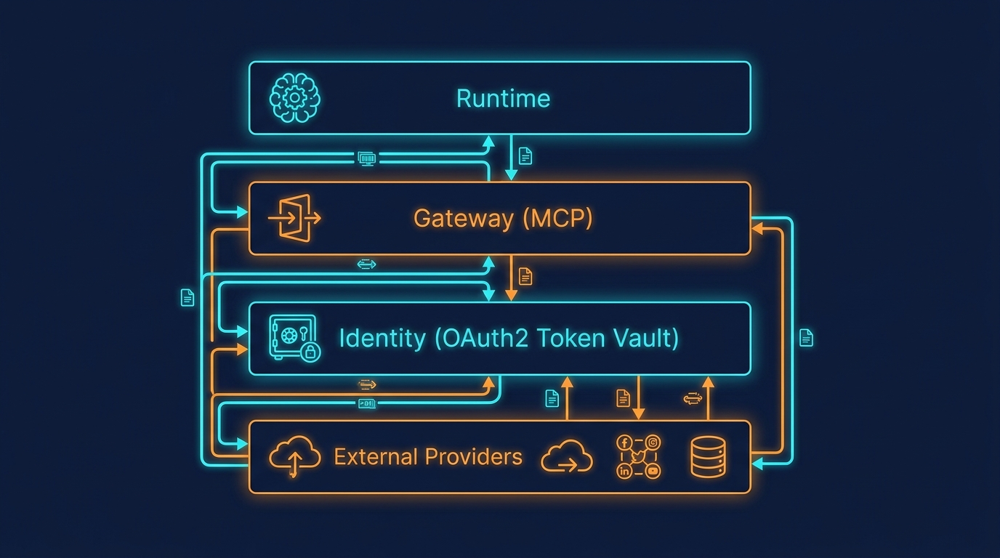
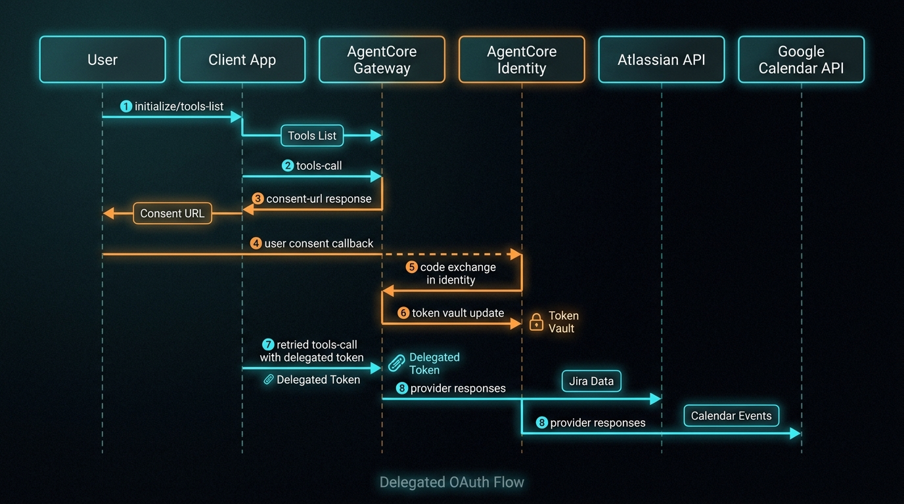
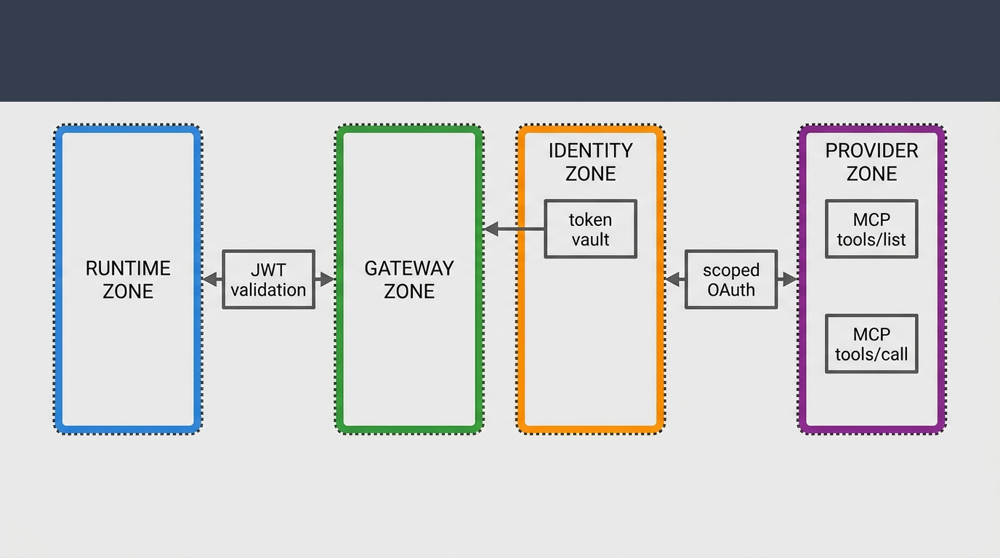

# AgentCore Identity

Production-grade reference architecture for identity-safe AI agent orchestration on Amazon Bedrock AgentCore.

This repository shows how to run delegated OAuth across multiple provider APIs without collapsing security boundaries between runtime orchestration and credential custody.



## Problem Statement

Most agent systems fail in production at the identity boundary, not in prompt logic.
The recurring failure pattern is mixing tool orchestration, token exchange, and provider execution in the same layer.
That design increases credential exposure risk, weakens policy enforcement, and makes OAuth resume flows unreliable.

## Reference Scope

This implementation is scoped to:

- Inbound identity validation with Cognito JWT
- MCP tool discovery and routing through AgentCore Gateway
- Outbound delegated OAuth through AgentCore Identity token vault
- Multi-target orchestration (Atlassian + Google Calendar)
- CDK infrastructure isolated from runtime code

## Architecture Visuals

### 1) System Map: Runtime, Gateway, Identity, Providers


This diagram defines the system decomposition and ownership boundaries.

How to read this image:

1. Start at the **Runtime zone**:
   - Prompt orchestration, intent handling, and tool selection happen here.
   - Runtime decides *what to call* but does not own provider credentials.
2. Move to the **Gateway zone (MCP)**:
   - Protocol boundary for `tools/list` and `tools/call`.
   - Routing and contract controls are enforced before external calls.
3. Move to the **Identity zone**:
   - Delegated OAuth exchange and token vault operations are isolated here.
   - This separation is the core security decision of the architecture.
4. End at **External providers**:
   - Atlassian and Google APIs are called with delegated, scoped credentials.
   - Provider calls happen only after validated routing and identity checks.

Architecture decision encoded by this view:

- Runtime orchestration and credential custody are intentionally separated.
- Control plane and credential plane are not collapsed into one component.

### 2) Delegated OAuth Flow Sequence

This sequence describes the request lifecycle for a provider action that requires delegated user consent.



How to read this image:

1. Request enters the gateway and available tools are discovered (`tools/list`).
2. A provider-specific call is attempted (`tools/call`).
3. If delegated consent is missing, the flow emits an OAuth consent URL.
4. User completes consent and callback returns to the identity boundary.
5. Identity performs code exchange and persists delegated token material.
6. Original operation is retried with scoped delegated credentials.
7. Gateway returns normalized response to runtime/client.

Operational value of this image:

- It makes the consent interruption point explicit.
- It shows why the flow is resumable after callback.
- It highlights where to instrument traces for incident diagnosis.

### 3) Zero-Trust Boundary Model

This model is security-first: it defines what each zone is allowed to see and do.



How to read this image:

1. Vertical boundaries represent trust cuts between runtime, gateway, identity, and provider planes.
2. Lock/shield markers represent policy enforcement points.
3. Labels such as JWT validation, token vault, and scoped OAuth mark where security controls are anchored.

Security assumptions encoded by this image:

- Runtime must never persist or own provider secrets.
- Token handling is restricted to the identity boundary.
- Gateway is an enforcement/routing boundary, not a credential store.
- External providers are reachable only through scoped delegated access.

Audit checklist derived from this image:

- Verify JWT and scope enforcement at ingress/gateway.
- Verify token vault access is restricted to identity paths only.
- Verify provider calls always use delegated scoped credentials.
- Verify logs avoid leaking raw token material.

### Code Mapping (Image -> Implementation Surface)

- System map:
  - runtime orchestration in `src/agents/`
  - gateway and service wiring in `src/deployment/`
  - identity and OAuth boundaries in `src/auth/` and `src/vault/`
- OAuth sequence:
  - request/flow scripts in `scripts/` (discovery, consent, E2E flows)
  - provider logic in `src/providers/`
- Zero-trust model:
  - scope and auth policy in `src/auth/`
  - secure credential handling in `src/vault/` and `src/storage/`

## Repository Structure

- `src/`: runtime, auth, providers, MCP services
- `infra/cdk/`: CDK app and stack definitions
- `scripts/`: validation and automation utilities
- `scripts/deploy/`: deployment entry scripts
- `deployment/`: deployment assets and phased workflows
- `deployment/compose/`: compose bundles for local/full-stack scenarios
- `examples/`: isolated runnable examples
- `docs/`: setup and deployment documentation

## Quick Start

### Prerequisites

- Python 3.11+
- Node.js 18+
- AWS CLI configured
- Docker (optional)

### Install

```bash
pip install -r requirements.txt
cd infra/cdk && npm ci
```

### Configure environment

```bash
export AWS_PROFILE=<AWS_PROFILE>
export AWS_REGION=<AWS_REGION>
export AWS_ACCOUNT_ID=<AWS_ACCOUNT_ID>
```

### Run locally

```bash
python entrypoint.py
```

### Deploy infrastructure (example)

```bash
cd infra/cdk
AWS_PROFILE=<AWS_PROFILE> AWS_REGION=<AWS_REGION> \
npx cdk deploy BedrockIdentityFull --require-approval never
```

## Documentation Index

- [Documentation Index](docs/README.md)
- [Atlassian OAuth Setup](docs/ATLASSIAN_OAUTH_SETUP.md)
- [Production Deployment](docs/PRODUCTION_DEPLOYMENT.md)
