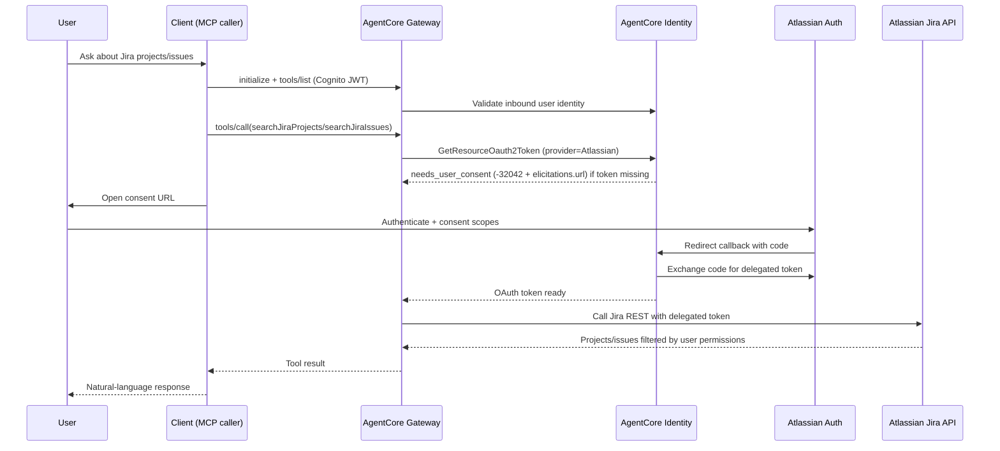

# Atlassian Agentic Flow (Detailed)

Date: 2026-03-10
Environment baseline: `<AWS_PROFILE> / <AWS_REGION> / <ENVIRONMENT>`

## Goal

Enable the existing Bedrock AgentCore runtime to answer Jira project/issue questions using delegated user OAuth (USER_FEDERATION) through an outbound Atlassian OAuth client.

## End-to-End Flow

## Access Control Model

- Inbound auth: Cognito JWT scopes gate access to gateway tools.
- Outbound auth: Atlassian delegated user token.
- Data boundary: Jira returns only resources visible to the authenticated Atlassian user.
- Scope boundary: `read:jira-work` + `read:jira-user` for read-only MVP.

## Tool Discovery and Selection Logic

The target tools are discovered dynamically via MCP, not hardcoded in the agent:

1. Client/agent calls `initialize`.
2. Client/agent calls `tools/list`.
3. Gateway returns all tools generated from registered targets and OpenAPI operationIds.
4. Agent filters by tool name prefix:
   - `atlassian-openapi-<env>___listAtlassianAccessibleResources`
   - `atlassian-openapi-<env>___searchJiraProjects`
   - `atlassian-openapi-<env>___searchJiraIssues`
5. Agent chooses by intent:
   - unknown site -> `listAtlassianAccessibleResources`
   - project listing -> `searchJiraProjects`
   - issue retrieval -> `searchJiraIssues`

Reference implementation:
- `scripts/discover_gateway_tools.py`

## Failure Modes and Handling

1. No OAuth grant yet:
- Symptom: tool call returns `-32042` + `elicitations.url`.
- Action: user completes Atlassian consent URL.

2. Callback mismatch:
- Symptom: Atlassian OAuth error (`redirect_uri mismatch`).
- Action: ensure callback exactly `https://bedrock-agentcore.<region>.amazonaws.com/identities/oauth2/callback`.

3. Missing permissions in Jira:
- Symptom: empty project list or 403 from Jira API.
- Action: verify project-level permissions for the same Atlassian user account.

## Operational Runbook

1. Create Atlassian OAuth client in Atlassian Developer Console.
2. Add callback URL and Jira scopes.
3. Create OAuth Client in AgentCore Identity (provider Atlassian).
4. Run:
   - `scripts/deploy_atlassian_target.sh`
5. Validate:
   - `tools/list` includes Atlassian tools
   - first `tools/call` may request consent URL
   - second `tools/call` succeeds after consent

## Post-Deploy Validation Queries

- CloudFormation:
  - `aws cloudformation describe-stacks --stack-name bedrock-agentcore-identity-<ENVIRONMENT>`
- Gateway targets:
  - `aws cloudformation get-template --stack-name bedrock-agentcore-identity-<ENVIRONMENT> --output json | jq -r '.TemplateBody.Resources | to_entries[] | select(.value.Type=="AWS::BedrockAgentCore::GatewayTarget") | [.key, .value.Properties.Name] | @tsv'`
- Logs:
  - `/aws/bedrock-agentcore/runtimes/*` for runtime/gateway interaction errors.
