# The OAuth Wall That Kills Enterprise AI Agents (and How We Got Past It)

**Authors:** John Ruiz and Luis Dias

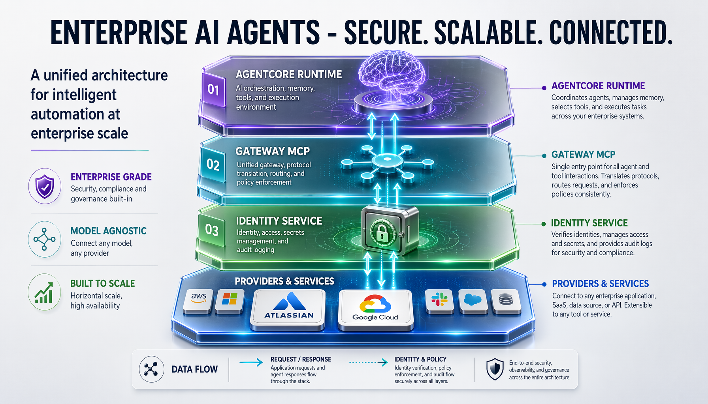
*Four-layer enterprise AI agent architecture: Runtime, Gateway (MCP), Identity Service, and multi-provider orchestration.*

Marcus stared at the CloudWatch logs at 3:14 AM, watching his AI agent fail OAuth consent for the eighth time that night. He'd been building enterprise agents for four months. The first demo was spectacular. A single agent answering questions from internal documentation. He showed it to the CTO on Monday. Budget approved by Wednesday.

Then someone from Product asked:

> "Can it pull Jira tickets, analyse priorities, and schedule follow-up meetings in Google Calendar? Using **each user's own credentials**?"

So Marcus built what seemed obvious: one agent calling Atlassian APIs and Google Calendar APIs. Two providers, one agent. Clean.

**On paper, clean. In production, impossible.**

Every invocation kicked off an OAuth dance. But where did the consent URL go? The agent returned it in its own reasoning. User clicks, redirect fails, callback URL mismatch. Tokens stored somewhere. For which user, nobody knew. The agent crashed when a second user ran the same query. Tokens leaked across sessions. A compliance audit was three weeks away.

Marcus had hit the wall that kills enterprise AI agents before they ship. Not because AI agents are bad. Because **coordinating delegated user OAuth across multiple providers is a fundamentally different problem from calling a single authenticated API**. And nobody had documented the engineering solution that works at scale.

Here's what his architecture looked like:

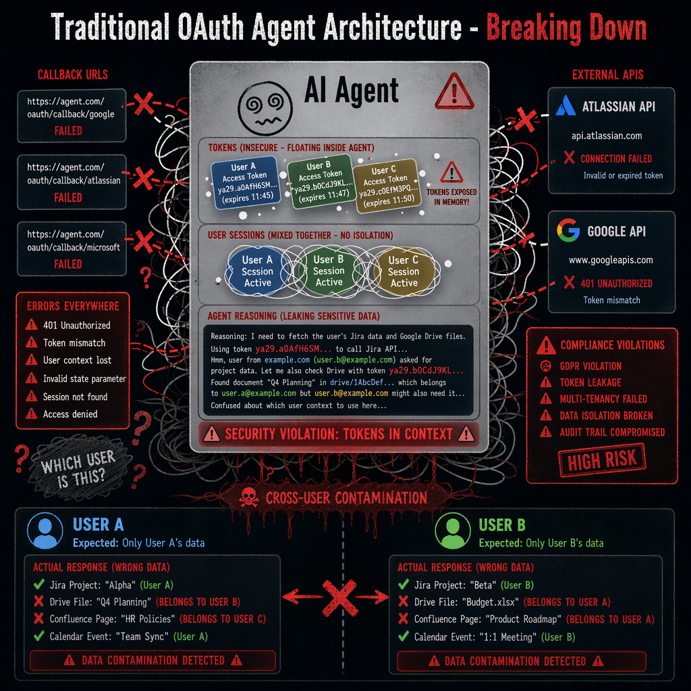
*The broken traditional approach: OAuth state scattered across agent context, user sessions, and provider callbacks.*

He was facing four problems simultaneously.

**1. The OAuth multi-provider nightmare.** The agent needs a delegated user token for Jira. Where does consent happen? How does the agent resume after the callback? How does it know which user? Now add Google Calendar. Different provider, different scopes, different flow. Tokens everywhere. No coordination. Debugging is archaeology.

**2. The token binding problem.** User A grants consent. Token stored. User B asks the same question. Which token gets used? User A's token with User B's request? That's an IAM audit failure. Multi-tenancy broken at the foundation.

**3. The zero-trust violation.** Tokens in agent context. Agent reasoning sees them. The model sees them. Logs contain them. Prompt cache keeps them. Token leakage through the reasoning chain is inevitable. Every layer is a GDPR violation waiting to happen.

**4. The cross-provider coordination disaster.** Agent pulls data from Jira, then creates a Calendar event. Jira call fails mid-run. Does the Calendar call proceed with stale data? How does the agent know Jira failed? Error buried in nested reasoning. No deterministic routing. No fallback. Garbage in, polished garbage out.

**This is why most enterprise AI agents never ship.** Not because the idea is bad. Because the engineering problems are real, the compliance requirements are non-negotiable, and the solutions aren't documented.

**Then Marcus found the architecture that changed everything.**

A four-layer design built on [AWS Bedrock AgentCore](https://aws.amazon.com/bedrock/agentcore/), AWS's managed platform for production AI agents. It ships three primitives that each do one job. **Runtime** hosts the agent and its reasoning loop. **Gateway** discovers and routes tools over [Model Context Protocol (MCP)](https://modelcontextprotocol.io/), the open protocol for plugging tools into agents. **Identity** manages OAuth tokens behind a zero-trust boundary. On top of those, a **Multi-Target Supervisor** coordinates work across providers.

Marcus rebuilt the agent in a weekend. Same two providers. But now tokens lived in a vault the Runtime couldn't see, every user had their own key, and the Supervisor routed calls like a concierge instead of guessing.

**Two months of iteration. 36 end-to-end scenarios covered**, including consent denial, revocation, scope mismatch, token refresh races, and cross-tenant queries. This article walks through how it works, and the pieces that cost us time to learn.

> **Reference pattern:** the AWS canonical AgentCore Identity tutorial at [awslabs/agentcore-samples/01-tutorials/03-AgentCore-identity](https://github.com/awslabs/agentcore-samples/tree/main/01-tutorials/03-AgentCore-identity) covers the building blocks. This article is our production experience layering a Multi-Target Supervisor on top.

---

## Problem 1: The OAuth Multi-Provider Coordination Nightmare

Marcus's first rebuild started here. Because in the old architecture, consent URLs lived inside agent reasoning, and that one detail poisoned everything downstream.

Picture it: your agent answers a question that needs data from both Atlassian Jira and Google Calendar. The user asks:

> *"Show me high-priority Jira issues and schedule a release readout meeting tomorrow morning."*

Simple in concept. But here's the question that breaks most architectures.

### Where does OAuth consent happen, and how does the agent resume?

If consent happens inline in agent reasoning, the agent returns a consent URL as text. The user clicks it outside the agent context. No way to resume. If you store tokens in agent memory, you've violated zero-trust. If you manage tokens in a database per-user, you've added infrastructure, multi-tenancy bugs, and an audit nightmare. And if tokens live inside implicit agent reasoning? Good luck passing a security review.

This is what most systems end up with: **OAuth state scattered across agent context, user sessions, and provider callbacks**. Data flows through implicit reasoning chains. You can't see it. You can't verify it. You can't audit it.

The traditional agent-does-everything approach:

1. Agent receives a prompt that needs an external API.
2. Agent invokes the tool. Tool returns 401. Agent extracts a consent URL.
3. Agent returns the consent URL to the user. But where? In reasoning? As tool output?
4. User clicks. Provider redirects to callback. Callback has a code.
5. Who exchanges the code for a token? Agent? Separate service? How does the agent resume?
6. Token stored where? For which user?

**You can't debug it. You can't replay it. You can't audit it.**

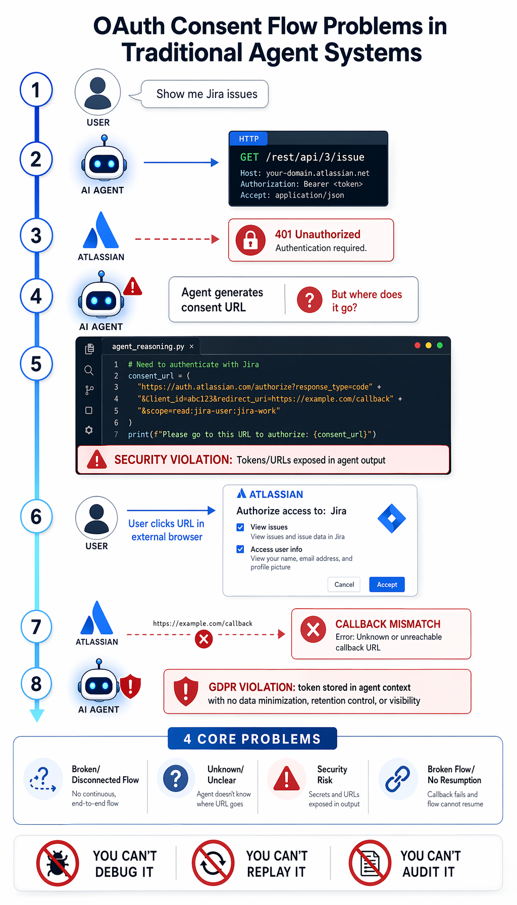
*Eight-step OAuth consent flow showing where traditional systems fail: callback mismatches, token leakage, and broken resumption.*

**AgentCore Identity's answer is deceptively simple: separate identity management from agent orchestration entirely.**

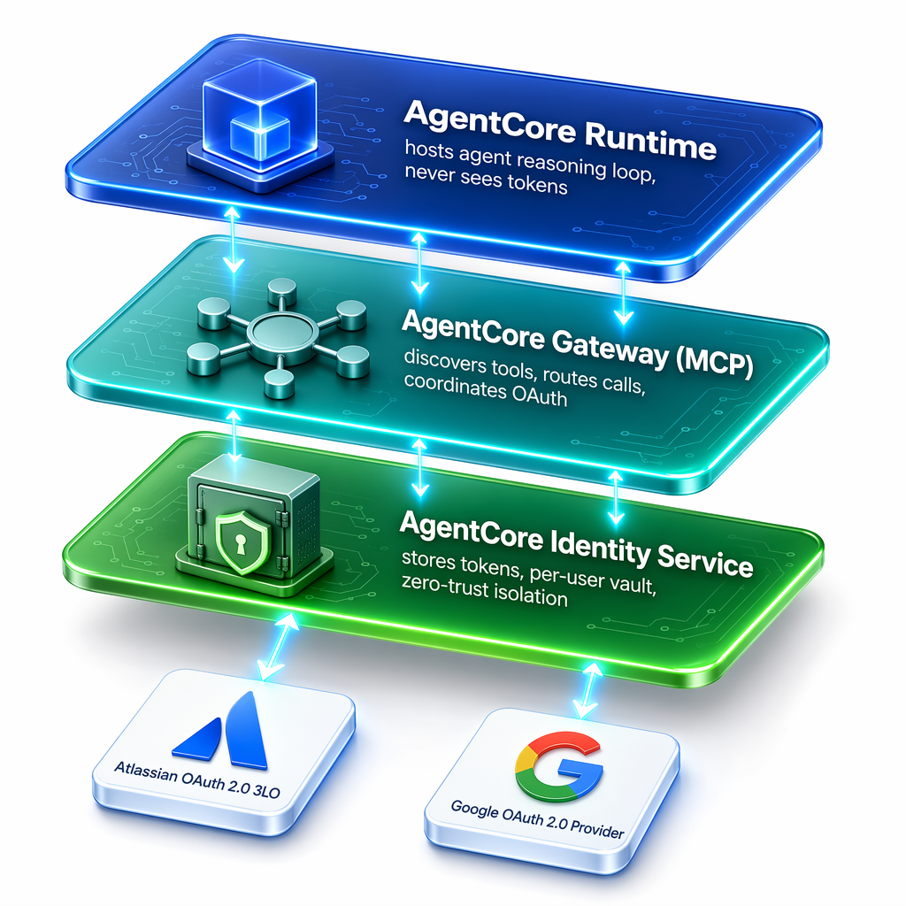
*Clean separation: Runtime never sees tokens, Gateway coordinates OAuth, Identity stores credentials per-user.*

Every component does one thing:

- **Runtime** hosts the agent and sends tool calls to Gateway.
- **Gateway** exposes the MCP tool catalogue, routes calls to Identity.
- **Identity** manages per-user tokens in an encrypted vault and handles consent.
- **Supervisor** coordinates multi-target execution with deterministic fallback.

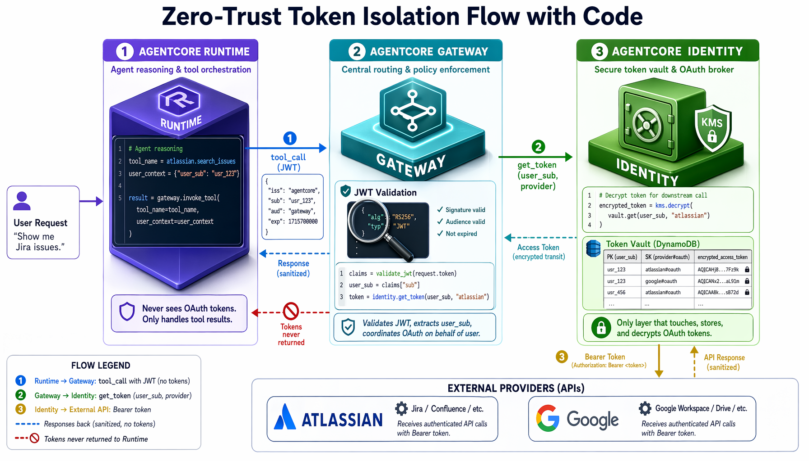
*Request flow showing how tool calls traverse layers with code snippets for each component.*

Four layers. Visible. Auditable. Compliant. Every consent flow is traceable in CloudWatch. Token leakage is prevented by construction. Multi-provider coordination is deterministic.

---

## Problem 2: Token Binding and Multi-Tenancy Isolation

This was the bug that triggered Marcus's compliance escalation. One query from the wrong user's session, one response containing another user's Jira data, and the project was two weeks away from being shut down.

Your agent is serving multiple users. User A grants consent for Atlassian. Their delegated token is stored. User B then asks: *"Show me my Jira projects."*

**Which token gets used? User A's token for User B's request?**

Without proper token binding, the story is always the same. Token stored globally. All users share the same token. User B gets User A's data. Security violation. IAM audit failure. Multi-tenancy broken at the foundation. The project gets shut down before it ships.

Most systems store tokens against a vague "session ID" or "user context" that isn't cryptographically verified. The binding is implicit, brittle, impossible to audit.

**The right approach is a per-user token vault with inbound JWT verification.** Every token is bound to the tuple `(user_sub, provider_name)`. The `user_sub` comes from a validated [Amazon Cognito](https://aws.amazon.com/cognito/) JWT, the signed identity token each user carries. Before any token lookup, the Gateway verifies the JWT signature, expiry, and issuer, extracts the user identity, and passes it to Identity. Identity cannot return a token for a different user. The binding simply doesn't exist for them.

We didn't build the vault ourselves. AgentCore Identity ships one: a managed, KMS-encrypted credential store where each record is bound to the `(agent identity, user identity, provider)` tuple (per the [AWS docs](https://aws.amazon.com/blogs/security/securing-ai-agents-with-amazon-bedrock-agentcore-identity/)). You can use the service-managed KMS key or bring your own. Our Gateway layer validates the inbound JWT and passes the `user_sub` to Identity's `GetResourceOauth2Token` call. That's the whole storage story.

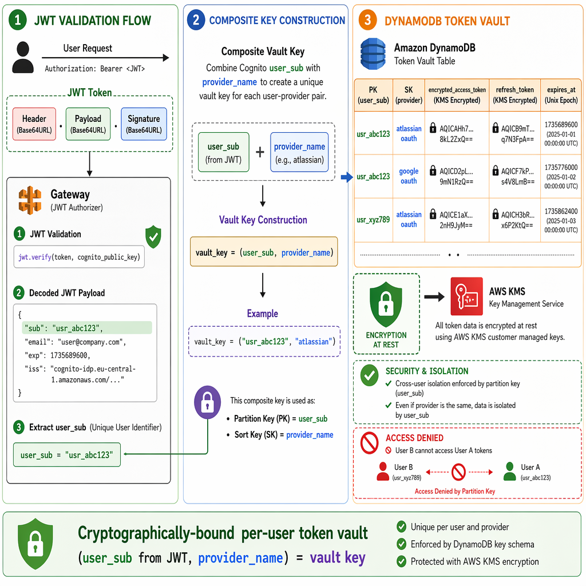
*JWT validation flow: Gateway verifies user identity before requesting tokens from Identity Service.*

When User B requests Jira data:

1. User B sends the request with their Cognito JWT.
2. Gateway validates the JWT and extracts the `sub` claim.
3. Gateway asks Identity for `(user_sub=UserB, provider=atlassian)`.
4. Identity looks up `(UserB, atlassian)` in its managed vault.
5. If missing, it returns a consent URL **for User B specifically**.
6. If present, it returns User B's token. Never User A's.

**Cross-user token leakage cannot happen. The key doesn't exist.**

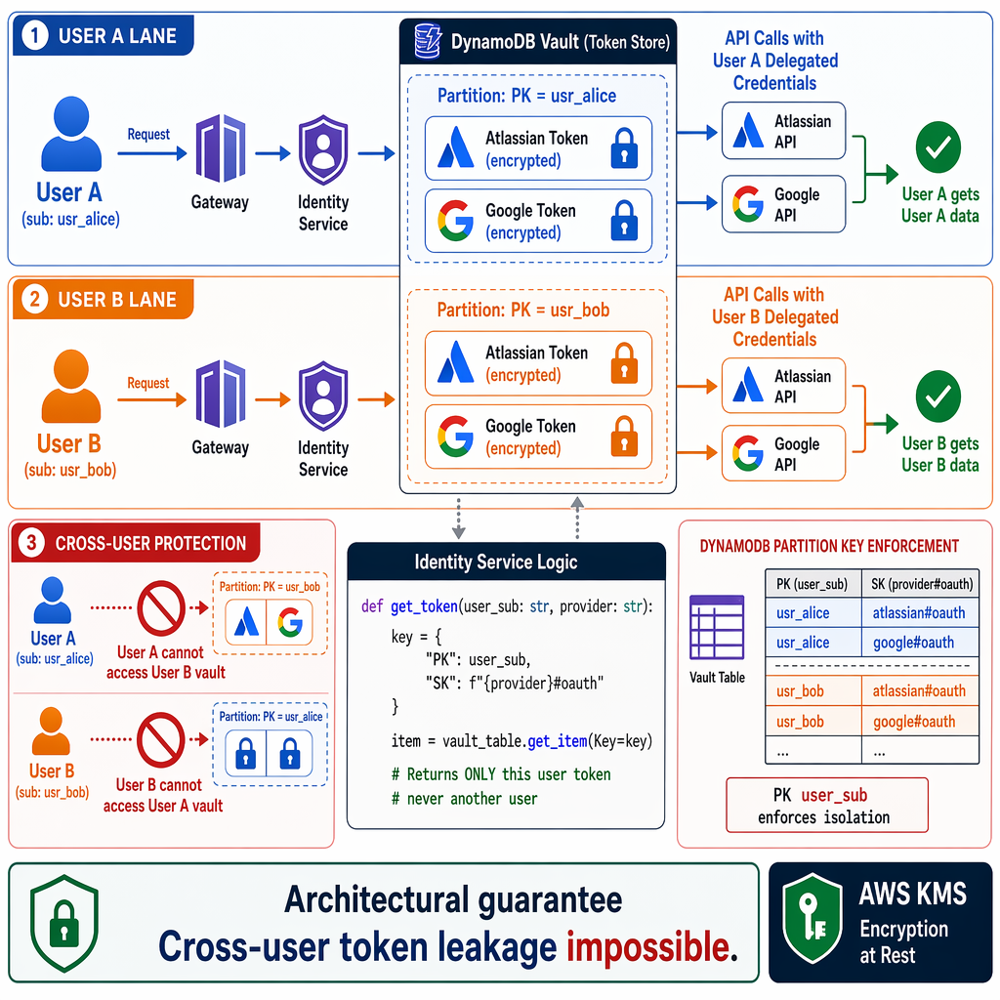
*Per-user token vault with KMS encryption: cross-user token leakage is architecturally impossible.*

Full audit trail per user per provider via CloudWatch. Compliance-ready design for GDPR, HIPAA, and SOC 2. Not because of process, but because of architecture.

---

## Problem 3: Zero-Trust Token Isolation, the Hidden Compliance Killer

Marcus's third iteration fixed the leak he couldn't see. The tokens weren't in the database. They were in the agent's own memory.

Standard agent systems accumulate secrets in their reasoning context like oil in an engine. Iteration 1: the agent calls Atlassian, the token appears in the tool response. Iteration 2: agent reasoning references "the token from step 1". By iteration 5, tokens are embedded in context, cached in prompts, logged in debug output.

Then your security team runs a prompt cache audit. Tokens in cached reasoning. Tokens in CloudWatch logs. Tokens in the model context window. **Every location is a GDPR violation.** Token leakage through reasoning is inevitable the moment tokens touch agent context.

This is compliance poison. If tokens can be reconstructed from agent reasoning, you've failed [zero-trust](https://csrc.nist.gov/publications/detail/sp/800-207/final). If they exist in logs, you've failed audit. If they sit in cached prompts, you've failed encryption-at-rest.

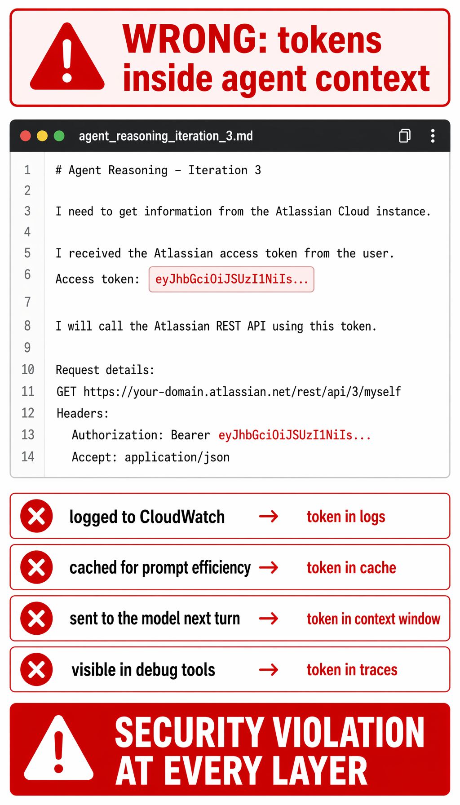
*How tokens leak in traditional systems: exposed in logs, cached prompts, context windows, and debug tools.*

Here's the metaphor that finally made it click for Marcus's security team: **treat OAuth tokens like a car at a valet stand.** The valet has the keys. You never see them. You get an outcome. Your car comes back, or it doesn't. Nothing about the keys ever enters the lobby where you're sitting.

That's AgentCore Identity. The Runtime is the lobby. Tokens are the keys. The valet is the only one who touches them.

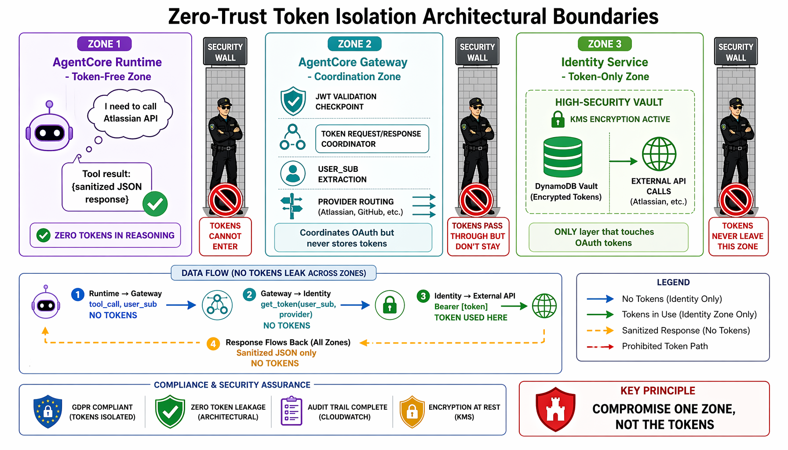
*Three security zones with physical separation: Runtime (token-free), Gateway (coordination), Identity (vault).*

Tokens never enter agent context. Ever. The Runtime has zero access to OAuth tokens. Only the Gateway talks to Identity, and only Identity touches tokens. The contract is simple:

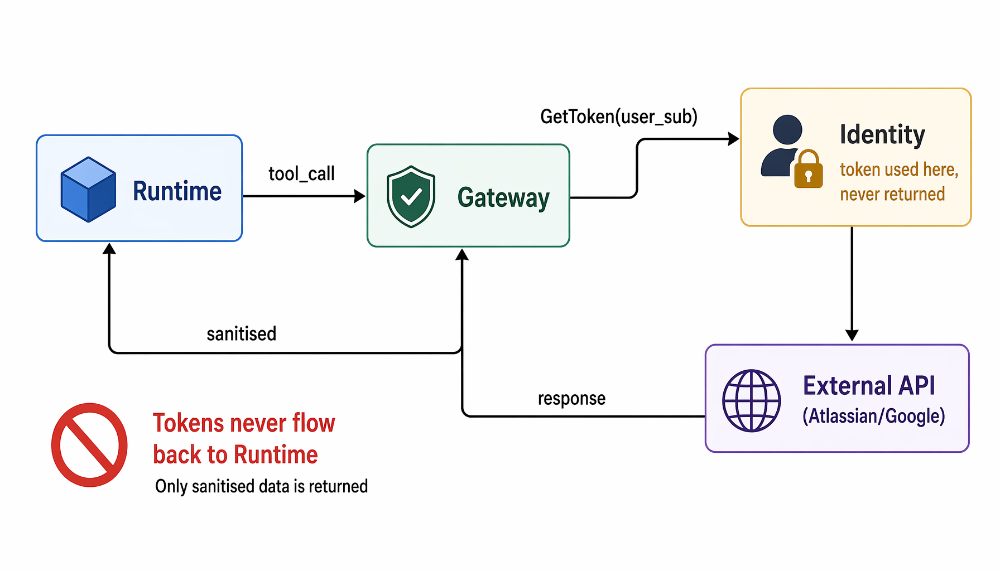
*Token isolation contract: tokens used at Identity, sanitized responses flow back to Runtime.*

The Runtime only ever sees the tool catalogue, sanitised API responses, and an OAuth status flag (`needs_consent` or `ok`). Never a token.

**Runtime reasoning never contains tokens. Logs never contain tokens. Context never contains tokens.**

---

## Problem 4: Cross-Provider Orchestration and Deterministic Fallback

By the time Marcus got to this one, he'd already learned the lesson: the agent shouldn't decide what's possible. The catalogue should.

Your agent needs to coordinate across providers:

1. List Jira projects (Atlassian)
2. Search for high-priority issues (Atlassian)
3. Create a calendar event (Google)

Step 2 fails. Does the agent proceed to the calendar step with stale data? Does it hallucinate a tool call when the Atlassian target isn't deployed? How does it know which tools actually exist?

Without deterministic routing and tool discovery, here's what fails every time. The agent hardcodes `atlassian_search_issues`. The Atlassian target isn't deployed in this environment. The agent invokes it anyway. Runtime crashes with "tool not found". No fallback. Just failure.

Or worse: Jira search returns empty because OAuth quietly failed. The agent doesn't notice. It creates a Calendar event with description "Review [] high-priority issues". User gets a notification for a meeting with no agenda. Trust destroyed.

**The traditional approach**: hardcode tool names, hope they exist, retry on error, pray.

**AgentCore's answer: dynamic tool discovery, deterministic routing, graceful fallback.**

Before any agent invocation, the Gateway exposes a live tool catalogue via MCP `initialize` + `tools/list`. The agent Runtime never assumes tool names. It reads them from the catalogue.

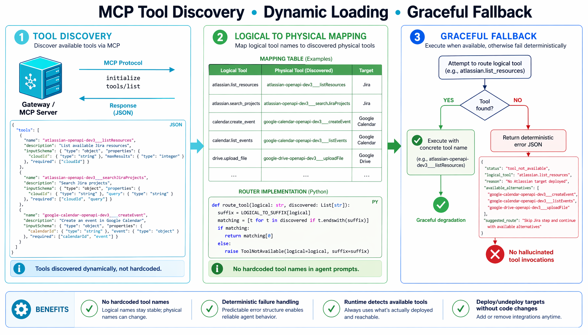
*Dynamic tool discovery via MCP: Runtime reads the live catalogue, never assumes tool names exist.*

The Multi-Target Supervisor adds a router that maps **logical capabilities** to **discovered tool names**:

```python
LOGICAL_TO_SUFFIX = {
    "atlassian.list_accessible_resources": "___listAtlassianAccessibleResources",
    "atlassian.search_projects":           "___searchJiraProjects",
    "atlassian.search_issues":             "___searchJiraIssues",
    "google.create_calendar_event":        "___createCalendarEvent",
}

def route_tool(logical_tool, discovered_tools):
    suffix = LOGICAL_TO_SUFFIX.get(logical_tool)
    matching = [t for t in discovered_tools if t.endswith(suffix)]
    if not matching:
        return ToolNotAvailable(
            reason=f"No target deployed for {logical_tool}",
            suggested_route="Skip or fail based on step.required",
        )
    return ToolRoute(tool_name=matching[0])
```

If the tool doesn't exist, the router returns **deterministic metadata** instead of crashing. The Supervisor then makes an explicit decision: required step, fail fast. Optional step, proceed and adjust.

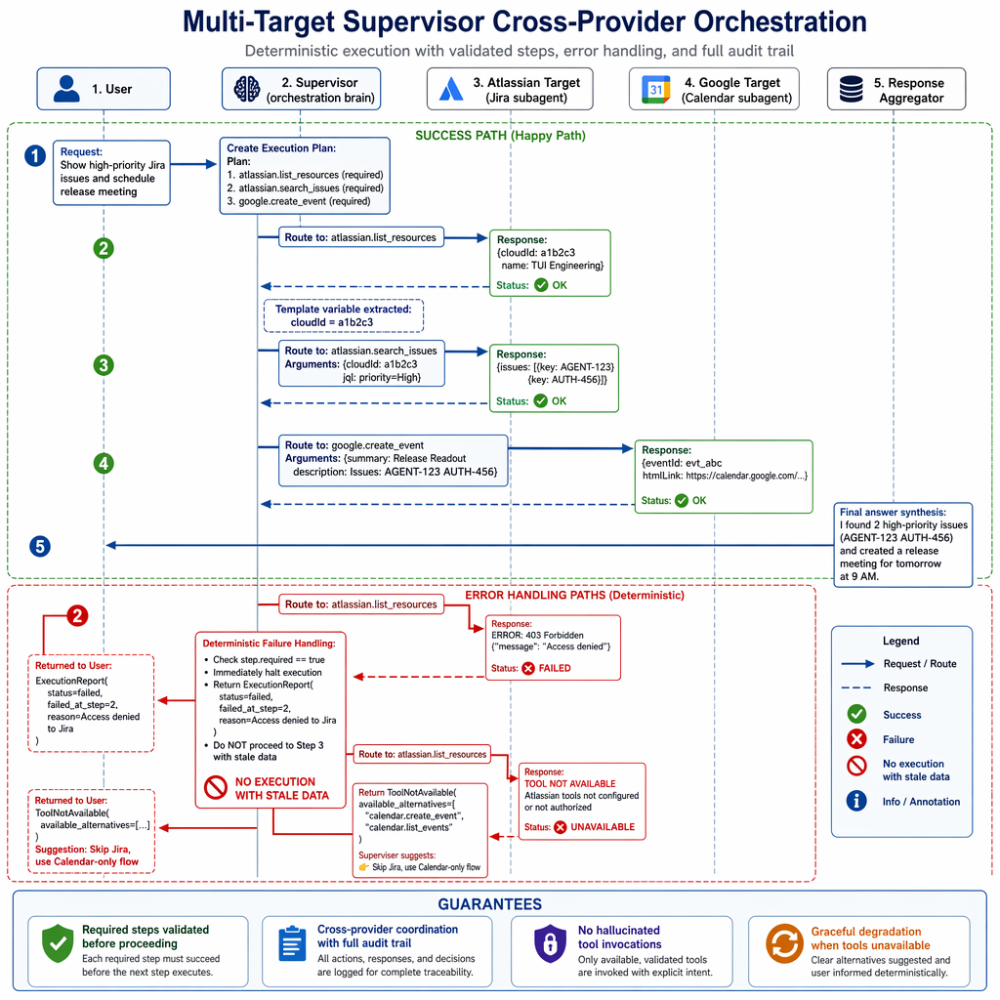
*Supervisor maps logical capabilities to discovered tools with deterministic fallback on missing targets.*

The result: no hallucinated tool calls, deterministic failure handling, graceful degradation, and a full audit trail for every step.

---

## The Solution in One Picture: the Four-Layer Architecture

Four components, each doing one job. None of them alone is enough. Together, they close every gap from the four problems above.

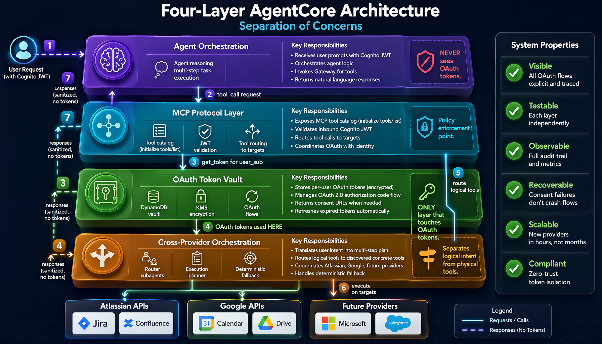
*Complete architecture: Runtime, Gateway (MCP), Identity (vault), and Supervisor orchestrating across providers.*

**Layer 1. AgentCore Runtime (hosting).** Receives user prompts with an authenticated Cognito JWT. Hosts the agent and its reasoning loop in an isolated microVM session. Invokes the Gateway. Never sees OAuth tokens, never hardcodes API endpoints, never stores credentials. It focuses purely on thinking.

**Layer 2. AgentCore Gateway (MCP protocol).** Exposes the tool catalogue via `initialize` + `tools/list`. Validates the inbound JWT before any tool call. Routes calls to the right target. Coordinates OAuth with Identity. This is the policy enforcement point, but tokens never leave Identity.

**Layer 3. AgentCore Identity (token vault).** The only layer that touches OAuth tokens. Stores them per-user in AgentCore Identity's managed vault, encrypted with KMS (service-managed by default, customer-managed for BYOK). Manages the [OAuth 2.0 3LO](https://developer.atlassian.com/cloud/jira/platform/oauth-2-3lo-apps/) authorisation code flow across providers. Returns consent URLs when needed. Refreshes expired tokens. Records are bound to `(user_sub, provider_name)`.

**Layer 4. Multi-Target Supervisor (cross-provider orchestration).** Translates user intent into a multi-step plan. Routes logical tools to discovered concrete tools. Coordinates Atlassian, Google, and any future provider. Handles deterministic fallback. Separates **logical intent** from **physical tools**.

Together, these four layers produce a system that is visible, testable, observable, recoverable, scalable, and compliant by design.

---

## What This Costs: The Honest Tradeoffs

No architecture is free. If someone tries to sell you one that is, walk away. Here's what a zero-trust multi-provider AgentCore stack costs in practice.

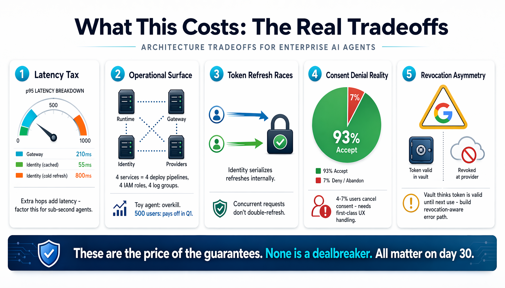
*Real costs: latency (210ms Gateway, 55ms Identity), operational complexity, token refresh races, consent denial rates.*

**Latency tax.** Every tool call now traverses Runtime, Gateway, Identity, external API, and back. In our setup (eu-central-1, single-region, chat-style workload), p95 at the Gateway sits around 210ms, and Identity adds roughly 55ms for a cached token. On a cold refresh, closer to 800ms. Your numbers will vary with region, scale, and how warm the path is. The shape matters more than the absolute figures. Factor in the extra hops before committing to sub-second voice agents.

**Operational surface area.** Four services instead of one. Each needs its own deploy pipeline, IAM role, CloudWatch log group, and on-call rotation. For a single-provider toy agent, this is overkill. For three providers and 500 users, it pays for itself inside a quarter.

**Token refresh races.** When two concurrent requests from the same user hit an expired token, both want to refresh. AgentCore Identity serialises refresh internally per credential, so you don't own this problem directly. But if your Gateway layer wraps calls, make sure you don't issue your own parallel refreshes on top. We had a bug here until we centralised every refresh behind one `GetToken` call.

**Consent denial is a real flow, not a happy-path afterthought.** In our early weeks, users cancelled the consent screen around 4 to 7 percent of the time. Small sample, but enough to confirm the flow needs first-class handling. Your UX has to distinguish "denied" (don't ask again for 24 hours) from "abandoned" (prompt on next query). Early versions did neither, and users complained the agent was broken.

**Revocation asymmetry.** A user revokes access from Google's side. Your vault still thinks the token is valid until you try to use it. Build a revocation-aware error path, or you'll leak quiet failures into responses.

These are the price of the guarantees. None is a dealbreaker. All of them matter on day 30.

---

## Five Things We Got Wrong (and How We Fixed Them)

The architecture above didn't arrive fully formed. It's what's left after two months of removing things that didn't work.

**1. We let the agent decide when to refresh tokens.** It decided badly. Refreshes fired mid-reasoning, latency spiked, and two users got rate-limited by Google because we burned refresh calls. Fix: make refresh a Gateway concern. Pre-emptive, with a 5-minute buffer before expiry. The agent stays out of it.

**2. We forgot about scope upgrades.** A user granted read-only access in February. We added a feature in March that needed write access. The agent silently failed with partial results. Fix: version the required scopes, detect the mismatch at Identity, trigger a re-consent flow that shows the user exactly what's new.

**3. Our first logical-tool router was too clever.** We tried fuzzy matching on tool names. It occasionally matched the wrong tool. Fix: exact-suffix matching against a hand-maintained registry. Boring. Correct.

**4. We used one shared service-managed KMS key for all tenants.** Passed review. Then an enterprise customer asked for tenant-specific customer-managed keys for BYOK compliance. Retrofitting this is painful. Fix: configure AgentCore Identity with a customer-managed KMS key per organisation from day one.

**5. We didn't log consent events.** When a user said "I never gave access", we had no record of the grant. Fix: structured consent events into CloudWatch, including IP, user-agent, and the exact scope list shown. Your legal team will thank you.

---

## Proof: a Real Multi-Target Flow

Here's what the finished system looks like running in production. Not a rehearsed trace. A real one, with the variance you'd expect.

**User prompt:** *"Show me high-priority Jira issues and schedule a release readout meeting for tomorrow morning."*

The Supervisor planned four steps. Here's what happened:

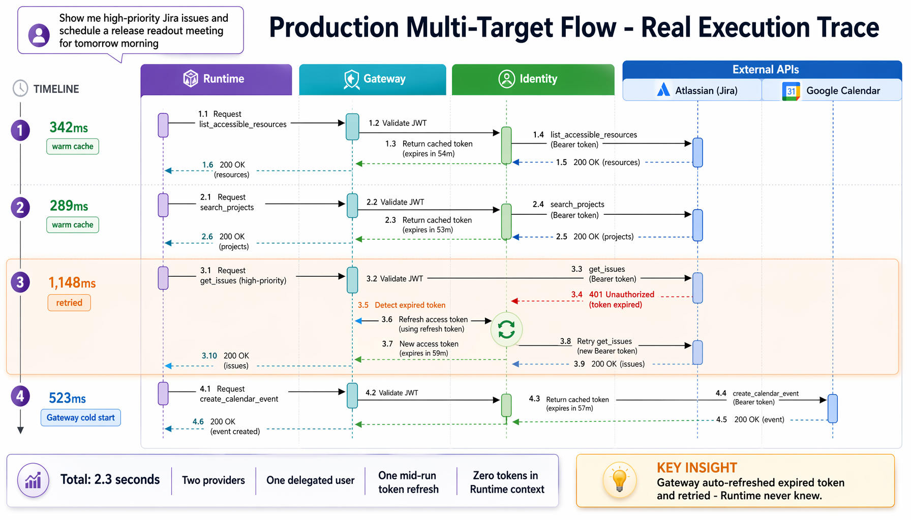
*Two providers. One delegated user. One mid-run token refresh. Zero tokens in Runtime context.*

Behind the scenes: Runtime called Gateway with the Cognito JWT. Gateway validated the JWT and extracted `user_sub`. Gateway asked Identity for the Atlassian token, got it, called Atlassian. On step 3, Atlassian returned 401. Gateway asked Identity to refresh, got a new token, retried once. Runtime never saw either token. It saw tool output, not credentials. Then Runtime produced the natural-language answer:

> *"I found 2 high-priority issues (AGENT-123, AUTH-456) and created a release readout meeting for tomorrow at 9:00 AM."*

Our test suite covers 36 scenarios like this one. Consent denial, revocation, scope mismatch, double-refresh races, cross-tenant queries, empty tool catalogue. All 36 pass before every deploy.

---

## Conclusion: Marcus Ships

Remember Marcus at 3:14 AM, watching his OAuth flow fail for the eighth time? That was two months ago.

Today his multi-provider agent runs in production with real enterprise users. When a user hasn't granted consent, the agent returns a clean consent URL, the user clicks, completes authorisation, and execution resumes. When a token expires mid-query, Gateway refreshes it before Runtime notices. When a user revokes access from Google's side, the next invocation surfaces a friendly re-consent prompt instead of a stack trace.

His security team doesn't escalate. They approve.

His CTO doesn't ask *"when will it be ready?"* anymore. He asks:

> "Can we add Microsoft Teams?"
> "Can we extend this to Salesforce?"

And the answer, every time, is **yes**, because the architecture was built to scale. Here's what's left after two months of iteration:

- **No tokens in agent context.** Zero-trust boundary enforced at the Gateway.
- **No cross-user leakage.** Per-user vault keyed on a JWT-verified `(user_sub, provider_name)`.
- **Clean compliance audits.** Full CloudWatch trail, KMS encryption, structured consent events.
- **New providers in hours, not weeks.** OAuth config to Identity, new Gateway target, done.

None of this is magic. AWS Bedrock AgentCore is generally available. MCP is a stable open protocol. OAuth 2.0 is mature. Cognito is boring. The hard part was never the pieces. It was refusing to put them together the lazy way.

> So here's the question: which OAuth provider have you been avoiding? The one where compliance said "not yet." The one that makes you explain, again, why the agent keeps breaking.

Build this for that one. The next five providers become hours of work, not months. And the discipline travels. Whatever comes after AgentCore (and something always does), the pattern of *separate identity, bind to verified user, discover don't hardcode, audit everything* outlives any specific AWS service.

If you try it, come back and tell us what broke on day 30. That's where the real architecture lives.

---

**Reference:** [AWS AgentCore Identity tutorial (awslabs/agentcore-samples)](https://github.com/awslabs/agentcore-samples/tree/main/01-tutorials/03-AgentCore-identity)

**AWS services used:** AWS Bedrock AgentCore (Runtime + Gateway + Identity) · Amazon Cognito · AWS KMS · AWS Lambda · Amazon CloudWatch

**Compliance-ready design:** GDPR-compatible (zero-trust token isolation) · SOC 2-aligned (full audit trail) · zero token leakage (architectural guarantee)

*If this was useful, consider starring the repo and sharing the OAuth rabbit hole you're stuck in.*
